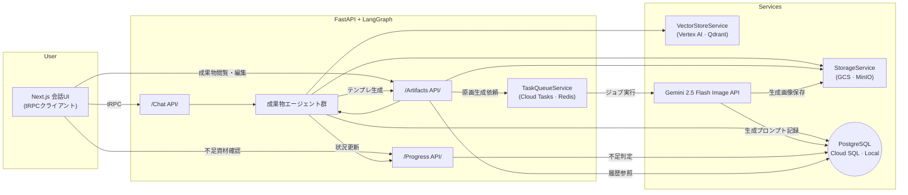

# ディレクトリ構成案とアーキテクチャ概要

## 1. リポジトリ運用前提
- 依存管理: Pythonは `uv` を用いた仮想環境 (`uv venv`) と依存ロック (`uv lock`)を前提にする。Next.js側は `pnpm` を推奨。
- ルートで `uv` の仮想環境ディレクトリ (`.venv/`) を管理し、バックエンドは `uv run` 経由で実行・テスト。
- バージョン管理: GitHubリポジトリを基盤とし、`main` / `develop` / feature ブランチ運用を推奨。CIはGitHub Actionsで uv + pnpm のセットアップを行う。
- `.env` と `.env.local` などの環境変数ファイルは `config/` 配下でテンプレート管理し、Git管理対象外の秘密情報は `.env.example` に記載する。

## 2. ディレクトリ構成案
```text
creative_workforce/
├── backend/
│   ├── app/                      # FastAPI + LangGraph ソースコード
│   │   ├── api/                  # エンドポイント定義
│   │   ├── agents/               # 成果物別エージェント実装
│   │   ├── core/                 # 設定・DI・共通ロジック
│   │   ├── models/               # Pydantic / SQLModel スキーマ
│   │   ├── services/             # StorageService / VectorStoreService / TaskQueueService
│   │   └── workers/              # 画像生成などのバックグラウンド処理
│   ├── scripts/                  # DBマイグレーション、ローカルセットアップスクリプト
│   ├── tests/                    # バックエンドのユニット・統合テスト
│   ├── pyproject.toml            # uv用メタデータ（project / dependencies）
│   └── uv.lock                   # 依存ロックファイル
├── frontend/
│   ├── app/                      # Next.js (App Router) ページ/ルート
│   ├── components/               # UIコンポーネント（チャット、サイドバー等）
│   ├── hooks/                    # React Query / Zustand Hooks
│   ├── lib/                      # APIクライアント (tRPC) / ユーティリティ
│   ├── public/                   # 静的ファイル
│   ├── package.json
│   └── pnpm-lock.yaml
├── infrastructure/
│   ├── docker-compose.yaml       # ローカル環境起動(PostgreSQL, MinIO, Redis, backend, frontend)
│   ├── Dockerfile.backend
│   ├── Dockerfile.frontend
│   ├── terraform/                # GCP向けInfrastructure as Code
│   └── github/                   # GitHub Actionsワークフロー(yaml)
├── config/
│   ├── env/
│   │   ├── .env.example          # 共通環境変数テンプレート
│   │   ├── .env.local.example    # ローカル用
│   │   └── .env.gcp.example      # GCPデプロイ用
│   └── prompts/                  # エージェント用プロンプトテンプレート
├── documents/                    # 企画書/提案書/仕様書/技術資料など
├── data/                         # （任意）サンプル成果物・テストデータ
├── scripts/                      # ルートから呼ぶ補助スクリプト（初期セットアップ等）
├── README.md
└── LICENSE
```

### ディレクトリ構成メモ
- `backend/services/` でローカル（MinIO/Redis）とGCP（GCS/Cloud Tasks）の実装差を吸収する。
- `infrastructure/docker-compose.yaml` では `uv run` を用いたバックエンド起動コマンドを記述。
- GitHub Actions（`infrastructure/github/`）は `uv sync && uv run pytest`、`pnpm install && pnpm lint` などを想定。

## 3. アーキテクチャ概要図（Mermaid）


### アーキテクチャ補足
- 画像生成ジョブは TaskQueueService を経由してGemini APIを呼び出し、結果をStorage/DBへ記録。ローカルでは Redis Queue を利用し、GCPでは Cloud Tasks + Cloud Run Jobs を利用する。
- VectorStoreService は全体仕様書/過去話をEmbedding化した検索用ストア。ローカルでは Qdrant コンテナ、GCPでは Vertex AI Vector Search を利用。
- 依存関係は環境変数と設定ファイルで切り替え、`uv run` でバックエンド・ワーカーを起動できるようにする。

## 4. ローカル開発フロー（uv × GitHub）
1. `uv venv` でルートに仮想環境を構築し、`source .venv/bin/activate`（または `uv run`）で利用。
2. `uv sync` で `pyproject.toml` / `uv.lock` の依存をインストール。フロントエンドは `pnpm install`。
3. `docker-compose up -d postgres minio redis` でバックエンド依存を起動し、`uv run fastapi dev`、`pnpm dev` でアプリを立ち上げる。
4. GitHubフロー: featureブランチで開発 → GitHubへPR → CIで `uv run pytest` / `pnpm lint` を実行 → レビュー後 `main` へマージ。
5. `.env.local` にはローカルAPIキー（OpenAI/Gemini）を設定し、GCPデプロイ時は `.env.gcp` をCloud Secret Managerに登録する。
